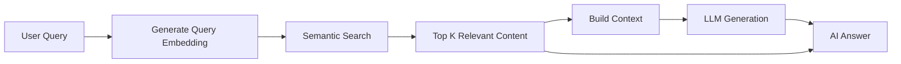

## Overview

AI Query transforms your Second Brain into an intelligent knowledge assistant. Instead of just searching for content, you can ask natural language questions and receive AI-generated answers based on your saved content using **Retrieval-Augmented Generation (RAG)**.

<Info>
  RAG combines semantic search with large language models to provide accurate, context-aware answers grounded in your personal knowledge base.
</Info>

## What is RAG?

**Retrieval-Augmented Generation (RAG)** is a two-step AI technique:

1. **Retrieval:** Find the most relevant content from your knowledge base using semantic search
2. **Generation:** Use an LLM to synthesize an answer based on the retrieved content

This approach ensures answers are:
- Grounded in your actual saved content
- More accurate than generic LLM responses
- Traceable to specific sources
- Personalized to your knowledge base



## How It Works

### The Complete RAG Pipeline

#### Step 1: Query Embedding

Your question is converted to a vector embedding optimized for retrieval:

```typescript
// From brain.controller.ts:49
const queryEmbedding = await generateQueryEmbedding(userQuery)
```

#### Step 2: Semantic Retrieval

The system finds the most relevant content using cosine similarity:

```typescript
// From brain.controller.ts:52-68
const scored = rows
    .map((row: any) => {
        const storedEmbedding = JSON.parse(row.embedding) as number[]
        const score = cosineSimilarity(queryEmbedding, storedEmbedding)
        return {
            id: row.contentId,
            title: row.title,
            link: row.link,
            type: row.type,
            description: row.description,
            score,
            tags: []
        }
    })
    .sort((a, b) => b.score - a.score)
    .slice(0, topK)
```

<Note>
  By default, the system retrieves the **top 5** most relevant items (configurable with `topK` parameter, max 20).
</Note>

#### Step 3: Relevance Filtering

Only content with similarity scores above 30% is considered:

```typescript
// From brain.controller.ts:81
const relevant = scored.filter((item) => item.score > 0.3)
```

#### Step 4: Context Building

Relevant content is formatted into a structured context:

```typescript
// From ai.service.ts:132-139
const contextParts = relevantContent.map((item, index) => {
    const tags = item.tags.length > 0 ? `Tags: ${item.tags.join(", ")}` : ""
    return `[${index + 1}] "${item.title}" (${item.type})
  Link: ${item.link}
  Description: ${item.description}
  ${tags}
  Relevance Score: ${(item.score * 100).toFixed(1)}%`
})
```

#### Step 5: AI Generation

The context and query are sent to Gemini for answer generation:

```typescript
// From ai.service.ts:123-164
export async function queryBrain(
    query: string,
    relevantContent: ContentWithScore[]
): Promise<string> {
    const ai = getGenAI()
    const model = ai.getGenerativeModel({ model: GENERATION_MODEL })

    const systemPrompt = `You are a helpful AI assistant for a "Second Brain" knowledge management app. 
The user has saved various content items (articles, videos, tweets, documents, etc.) in their second brain.
Below is the relevant content from their saved items that matches their query.

=== SAVED CONTENT ===
${contextParts.join("\n\n")}
=== END SAVED CONTENT ===

Instructions:
- Answer the user's question based on their saved content above.
- Reference specific items by their title when relevant.
- If the content doesn't seem to answer the question, say so and suggest what they might save to fill the gap.
- Be concise but helpful.
- If there is no relevant content at all, let the user know their second brain doesn't have information on this topic yet.`

    const result = await model.generateContent([
        { text: systemPrompt },
        { text: `User's question: ${query}` },
    ])

    return result.response.text()
}
```

## Gemini Integration

### AI Models Used

<CardGroup cols={2}>
  <Card title="Embedding Model" icon="vector-square">
    **gemini-embedding-001**
    
    - 768-dimensional embeddings
    - Optimized for semantic search
    - Separate task types for documents and queries
  </Card>
  <Card title="Generation Model" icon="sparkles">
    **gemini-2.5-flash-lite**
    
    - Fast response times
    - Context-aware generation
    - Optimized for retrieval-augmented tasks
  </Card>
</CardGroup>

### Configuration

```typescript
// From config.ts
export const GEMINI_API_KEY = process.env["GEMINI_API_KEY"]
export const GENERATION_MODEL = "gemini-2.5-flash-lite"
export const EMBEDDING_MODEL = "gemini-embedding-001"
export const EMBEDDING_DIMENSIONS = 768
```

<Warning>
  Set your `GEMINI_API_KEY` environment variable. Get a free API key at [Google AI Studio](https://aistudio.google.com).
</Warning>

### Rate Limiting & Retry Logic

The system includes exponential backoff for API rate limits:

```typescript
// From ai.service.ts:26-48
async function withRetry<T>(
    fn: () => Promise<T>,
    maxRetries = 3,
    baseDelayMs = 1000
): Promise<T> {
    let lastError: Error | undefined
    for (let attempt = 0; attempt < maxRetries; attempt++) {
        try {
            return await fn()
        } catch (err: any) {
            lastError = err
            // Only retry on 429 (rate limit) or 503 (service unavailable)
            if (err?.status === 429 || err?.status === 503) {
                const delay = baseDelayMs * Math.pow(2, attempt)
                console.warn(`Gemini API rate limited (attempt ${attempt + 1}/${maxRetries}), retrying in ${delay}ms...`)
                await new Promise((resolve) => setTimeout(resolve, delay))
                continue
            }
            throw err
        }
    }
    throw lastError
}
```

**Retry Strategy:**
- Max retries: 3 attempts
- Base delay: 1000ms (1 second)
- Exponential backoff: 1s → 2s → 4s
- Only retries on 429 (rate limit) or 503 (service unavailable)

## Using AI Query

### API Endpoint

```bash
POST /api/v1/brain/query
Authorization: Bearer <your-token>
Content-Type: application/json

{
  "query": "What are the best practices for React performance optimization?",
  "topK": 5
}
```

### Request Parameters

<ParamField path="query" type="string" required>
  Your natural language question (1-500 characters)
</ParamField>

<ParamField path="topK" type="integer" default={5}>
  Number of content items to retrieve for context (1-20)
</ParamField>

### Response Format

```json
{
  "message": "Query completed",
  "answer": "Based on your saved content, here are the key React performance optimization best practices:\n\n1. **Use React.memo** as mentioned in 'React Performance Guide' - This prevents unnecessary re-renders of functional components...\n\n2. **Code Splitting** from 'Advanced React Patterns' - Implement lazy loading with React.lazy() and Suspense to reduce initial bundle size...\n\n3. **Virtualization** as described in 'Optimizing Large Lists' - Use libraries like react-window for rendering large datasets efficiently...",
  "relevantContent": [
    {
      "id": 23,
      "title": "React Performance Guide",
      "link": "https://example.com/react-perf",
      "type": "article",
      "score": 89.2,
      "tags": ["react", "performance", "optimization"]
    },
    {
      "id": 47,
      "title": "Advanced React Patterns",
      "link": "https://example.com/react-patterns",
      "type": "video",
      "score": 76.8,
      "tags": ["react", "best-practices"]
    },
    {
      "id": 12,
      "title": "Optimizing Large Lists in React",
      "link": "https://example.com/list-optimization",
      "type": "article",
      "score": 71.5,
      "tags": ["react", "virtualization", "performance"]
    }
  ]
}
```

### Response Fields

<ResponseField name="message" type="string">
  Status message
</ResponseField>

<ResponseField name="answer" type="string">
  AI-generated answer based on your saved content
</ResponseField>

<ResponseField name="relevantContent" type="array">
  Array of source content items used to generate the answer
  
  <Expandable title="Content Item Properties">
    <ResponseField name="id" type="integer">
      Unique content identifier
    </ResponseField>
    <ResponseField name="title" type="string">
      Content title
    </ResponseField>
    <ResponseField name="link" type="string">
      Original content URL
    </ResponseField>
    <ResponseField name="type" type="string">
      Content type (article, video, tweet, etc.)
    </ResponseField>
    <ResponseField name="score" type="number">
      Similarity score (0-100)
    </ResponseField>
    <ResponseField name="tags" type="array">
      Associated tags
    </ResponseField>
  </Expandable>
</ResponseField>

## Edge Cases

### Empty Vault

When you have no saved content:

```json
{
  "message": "Your vault is empty! Start saving content to query it.",
  "answer": null,
  "relevantContent": []
}
```

### No Relevant Content

When no content matches your query above the 30% threshold:

```json
{
  "message": "No content in your second brain seems related to this query.",
  "answer": "I couldn't find any saved content that's relevant to your question. Try saving more content or rephrasing your query.",
  "relevantContent": []
}
```

### Knowledge Gaps

The AI will proactively suggest what content to save:

```
"Based on your saved content about React basics, I don't see any specific information about server-side rendering. You might want to save articles about Next.js or Remix to fill this gap in your knowledge base."
```

## Complete Implementation

Here's the full query controller logic:

```typescript
// From brain.controller.ts:19-123
export async function query(req: Request, res: Response) {
    try {
        const userId = req.userId
        if (!userId) {
            return res.status(401).json({ error: "Unauthorized" })
        }

        const parsed = querySchema.parse(req.body)
        const { query: userQuery, topK } = parsed
        const db = getDB()

        // 1. Get all embeddings for this user's content
        const rows = await db.all(
            `SELECT e.contentId, e.embedding, c.title, c.link, c.type, c.description
             FROM embeddings e
             JOIN content c ON e.contentId = c.id
             WHERE c.userId = ?`,
            [userId]
        )

        if (rows.length === 0) {
            return res.status(200).json({
                message: "Your vault is empty! Start saving content to query it.",
                answer: null,
                relevantContent: [],
            })
        }

        // 2. Generate query embedding
        const queryEmbedding = await generateQueryEmbedding(userQuery)

        // 3. Compute cosine similarity against all stored embeddings
        const scored = rows.map((row: any) => {
            const storedEmbedding = JSON.parse(row.embedding) as number[]
            const score = cosineSimilarity(queryEmbedding, storedEmbedding)
            return { id: row.contentId, title: row.title, link: row.link, 
                     type: row.type, description: row.description, score, tags: [] }
        })
        .sort((a, b) => b.score - a.score)
        .slice(0, topK)

        // 4. Fetch tags for the top results
        for (const item of scored) {
            const tags = await db.all(
                `SELECT t.title FROM tags t
                 JOIN content_tags ct ON t.id = ct.tagId
                 WHERE ct.contentId = ?`,
                [item.id]
            )
            item.tags = tags.map((t: any) => t.title as string)
        }

        // 5. Filter to only reasonably relevant results (similarity > 0.3)
        const relevant = scored.filter((item) => item.score > 0.3)

        if (relevant.length === 0) {
            return res.status(200).json({
                message: "No content in your second brain seems related to this query.",
                answer: "I couldn't find any saved content that's relevant to your question. Try saving more content or rephrasing your query.",
                relevantContent: [],
            })
        }

        // 6. Send to Gemini for RAG answer
        const answer = await queryBrain(userQuery, relevant)

        res.status(200).json({
            message: "Query completed",
            answer,
            relevantContent: relevant.map((item) => ({
                id: item.id,
                title: item.title,
                link: item.link,
                type: item.type,
                score: parseFloat((item.score * 100).toFixed(1)),
                tags: item.tags,
            })),
        })
    } catch (err: any) {
        if (err.name === "ZodError") {
            return res.status(400).json({ error: "Validation failed", details: err.errors })
        }
        if (err.message?.includes("GEMINI_API_KEY")) {
            return res.status(503).json({
                error: "AI service unavailable",
                message: err.message,
            })
        }
        console.error("Brain query error:", err)
        res.status(500).json({ error: "Failed to query brain" })
    }
}
```

## Best Practices

<AccordionGroup>
  <Accordion title="Optimize your queries">
    - Be specific and descriptive
    - Include relevant keywords and context
    - Ask one question at a time
    - Use complete sentences
  </Accordion>
  
  <Accordion title="Adjust topK parameter">
    - Default: 5 items (good for most queries)
    - Increase to 10-15 for broad topics
    - Decrease to 3 for focused questions
    - Max: 20 items
  </Accordion>
  
  <Accordion title="Build a rich knowledge base">
    - Save diverse content types
    - Include detailed descriptions
    - Use descriptive tags
    - Add context when saving content
  </Accordion>
  
  <Accordion title="Interpret relevance scores">
    - 80-100%: Highly relevant, directly answers query
    - 60-80%: Related content, useful context
    - 30-60%: Tangentially related
    - Under 30%: Not relevant (filtered out)
  </Accordion>
</AccordionGroup>

## Comparison: Query vs Search

| Feature | AI Query | Semantic Search |
|---------|----------|----------------|
| **Purpose** | Get answers to questions | Find similar content |
| **Output** | AI-generated text response | List of content items |
| **Processing** | Retrieval + Generation (RAG) | Retrieval only |
| **Model** | Gemini 2.5 Flash Lite | Gemini Embedding |
| **Use Case** | "Explain X based on my content" | "Show me content about X" |
| **Response Time** | Slower (~2-5s) | Faster (~1-2s) |
| **API Cost** | Higher (LLM generation) | Lower (embedding only) |

## Error Handling

<CodeGroup>

```json 400 Bad Request
{
  "error": "Validation failed",
  "details": [
    {
      "path": ["query"],
      "message": "Query cannot be empty"
    }
  ]
}
```

```json 401 Unauthorized
{
  "error": "Unauthorized"
}
```

```json 503 Service Unavailable
{
  "error": "AI service unavailable",
  "message": "GEMINI_API_KEY is not set. Get a free key at https://aistudio.google.com"
}
```

</CodeGroup>

## Next Steps

<CardGroup cols={2}>
  <Card title="Semantic Search" icon="magnifying-glass" href="/features/semantic-search">
    Learn about the underlying search technology
  </Card>
  <Card title="Content Management" icon="folder" href="/features/content-management">
    Discover how to organize your content effectively
  </Card>
</CardGroup>